

  

## 面试通

入门教程，开发指南，简单易学
HarmonyOS NEXT

- document https://zhousg.atomgit.net/interview_success/
- code https://github.com/HarmonyOS-Next/interview-handbook-project

HarmonyOS 4.0

- document https://harmonyos-next.github.io/interview-handbook-project/
- code https://github.com/HarmonyOS-Next/interview-handbook-project/tree/main

## Screen Shots

|                                     |                                     |
|-------------------------------------|-------------------------------------|
| 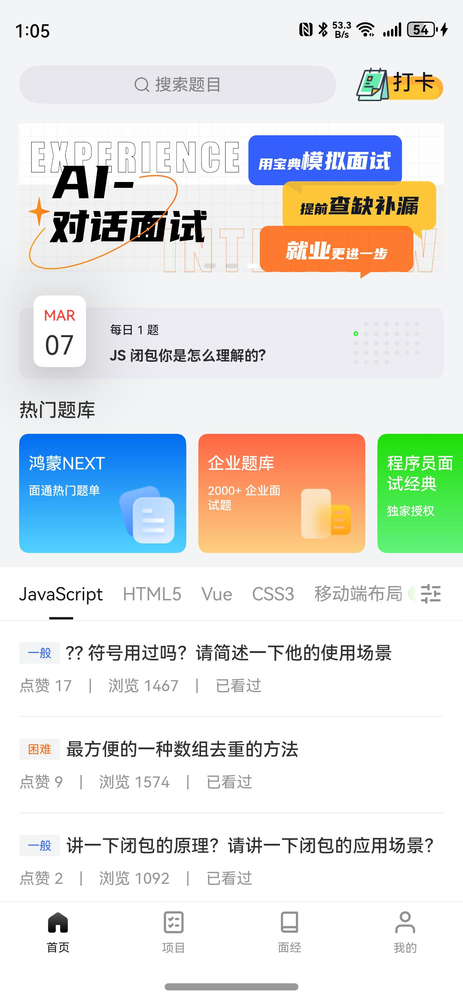 | 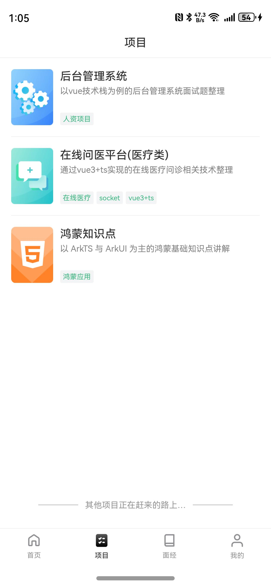 |
| 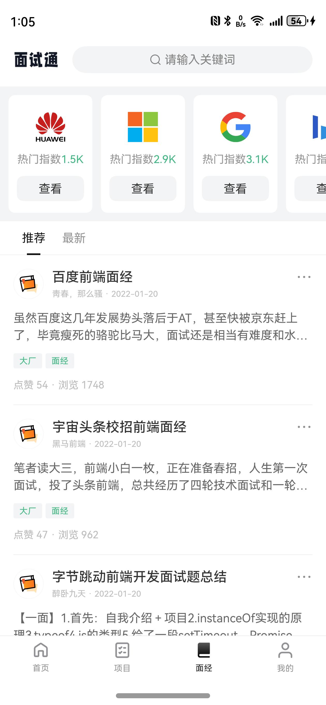 | 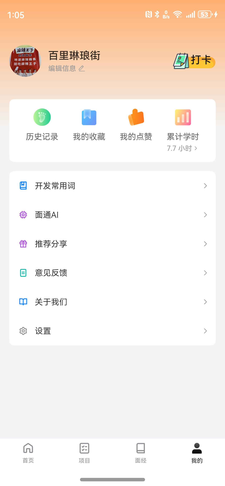 |
| 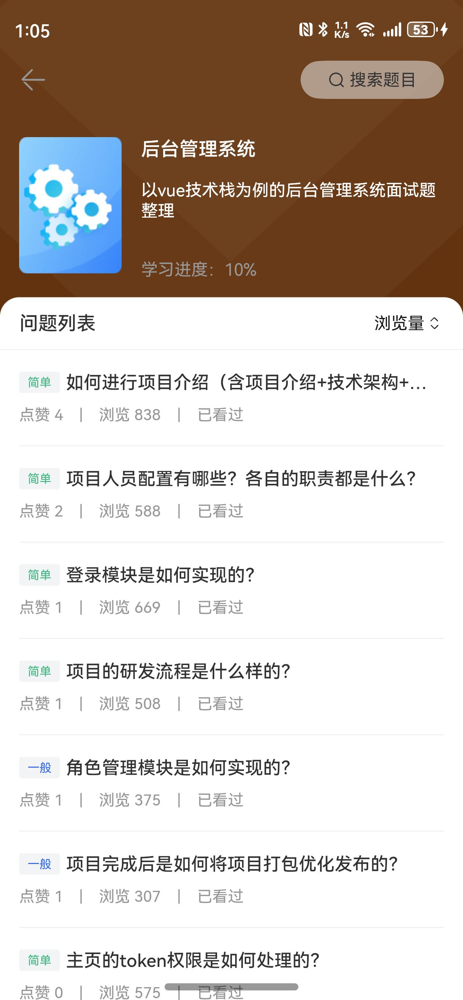 | 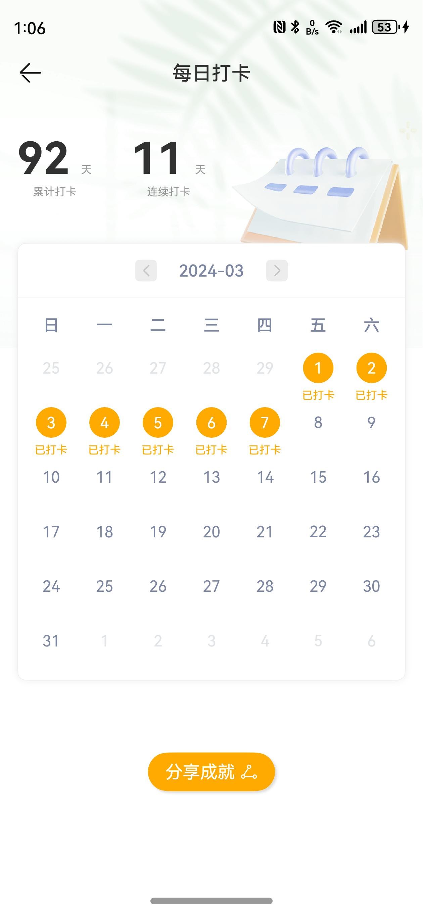 |
| 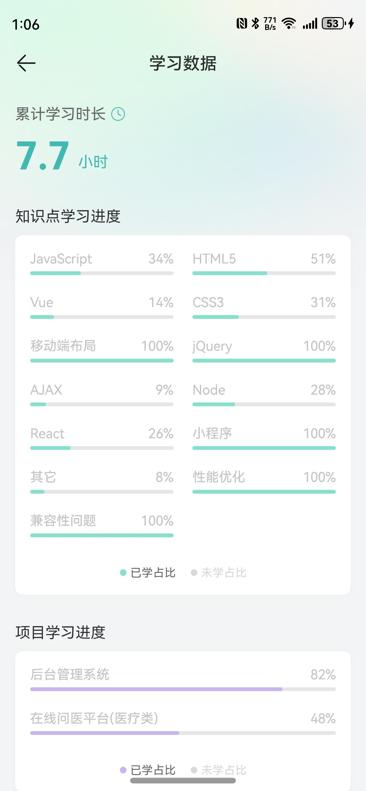 | 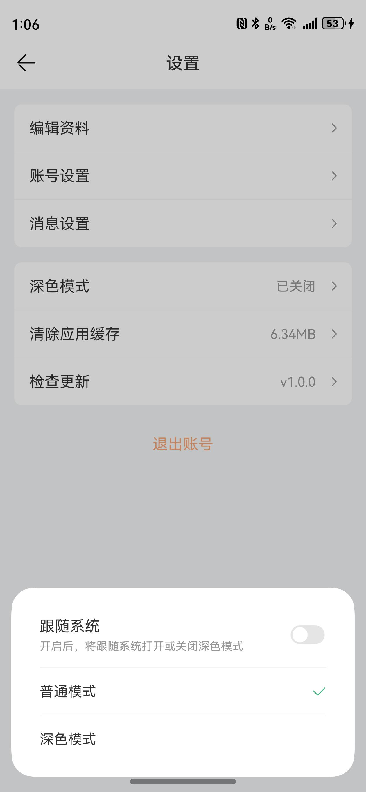 |
| 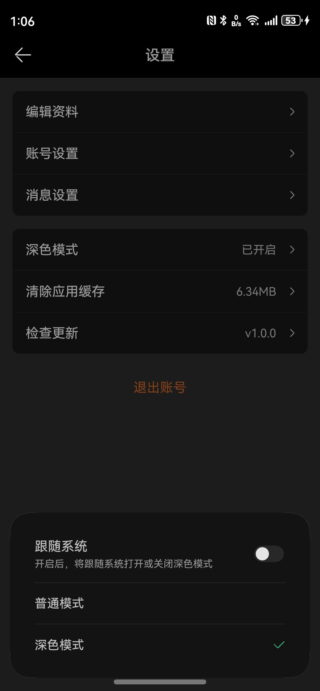 | 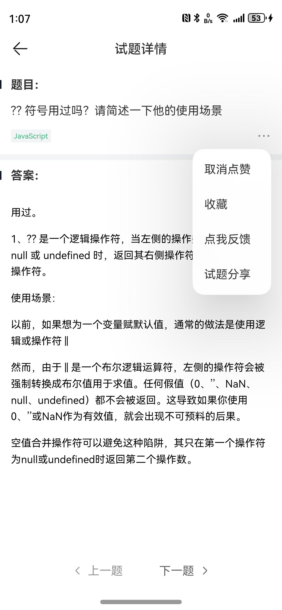 |
| 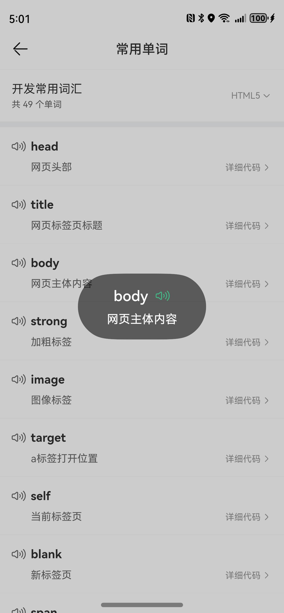 | 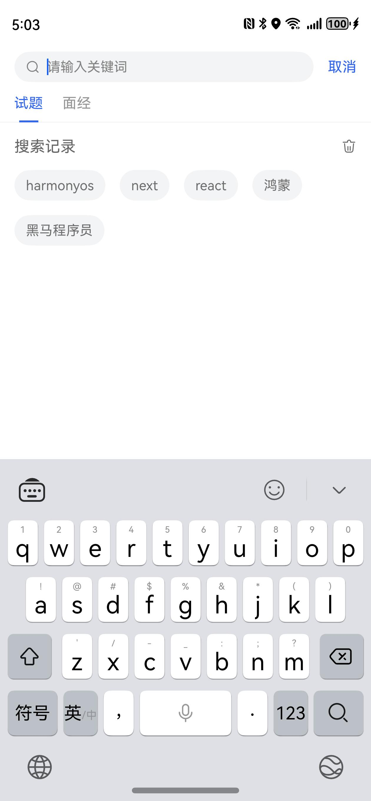 |